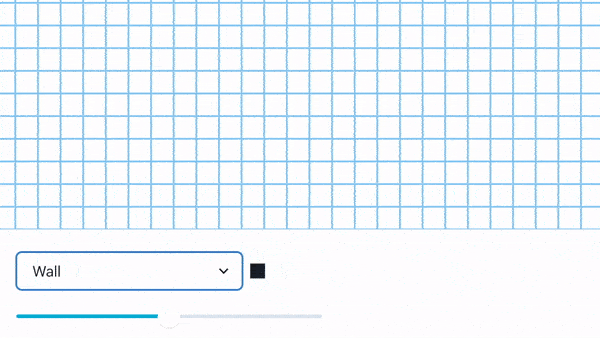

# Pathfinding Visualization
- This project is inspired by [@clementmihailescu](https://github.com/clementmihailescu) and [@DevonCrawford](https://github.com/DevonCrawford). The idea of learning algorithms through visualization interests me.
- This project is built as my attempt to re-study pathfinding algorithms which were introduced in my university course briefly.
- Despite the completion, this project isn't perfect and only plays as an individual approach of mine to the problem. I'm looking forward to getting feedback from other talented developers on how it can be improved both on performance and functionalities. Any star or review will be deeply appreciated. Thank you!
## "A demo is worth a thousand words"
[Demo link](https://ngquhuanbl.github.io/Pathfinding_Visualization/)
## Technology
### ReactJS
- I find ReactJS quite not-suitable for algorithm visualization. Compared to Vanilla JS approach of @clementmihailescu and the @DevonCrawford's Java version, ReactJS visualization is slower due to the extra cost for reconciliation before any UI change can be rendered.
- Despite the above judgment, this project is built as an attempt to learn how to optimize ReactJS. The resulted app should perform at a good speed which might not be comparable to other approaches, but the best as it could (while satisfying all required functionalities).
  - Common optimizing methods that I used: update function in `setState()`, `useCallback()`, `useMemo()`, `React.memo()`
  - I also experiment with the use of mutable states (created by `useRef()`) instead of normal React states (created by `useState()`) at some part of the application as a performance improvement. Such action is only suitable for some states and must be considered carefully based on two characteristics:
    - The state change won't require a UI render
    - The logic consuming/mutating the state will still be able to function probably if the state's consuming/mutating moment is affected by ReactJS batching behavior.
### Charka UI
- This project was my first time using this component library and it turned out to be pretty good. I spent less time writing UI code and the result is aesthetic. Highly recommended!
## Algorithms
### Pathfinding
#### Breadth First Search (BFS)
- Unweighted graph
- Explore equally in all directions
#### Early Exit BFS
- Unweighted graph
- Explore equally in all directions
- Stop the exploration as soon as we’ve found our goal instead of continuing to cover the graph fully
#### Dijkstra
- Weighted graph
- Explore equally in all directions
- Take movement costs into account
  - Moving through plains might cost 1 move-point
  - Moving through the desert area might cost 5 move-points
#### Greedy Best First Search
- Unweighted graph
- Explore towards the goal more than it expands in other directions
- In **Dijkstra’s Algorithm** we used the actual distance from the start for the priority queue ordering. In **Greedy Best First Search**, we’ll use the estimated distance to the goal for the priority queue ordering.
#### A*
- Weighted graph
- Explore towards the goal more than it expands in other directions
- **Dijkstra’s Algorithm** works well to find the shortest path, but it wastes time exploring in directions that aren’t promising. **Greedy Best First Search** explores in promising directions but it may not find the shortest path. → **A\* algorithm** is the best of both worlds. It uses both **the actual distance from the start (from Dijkstra's algorithm)**  and **the estimated distance to the goal (from the Greedy Best First Search).**

**Recommended pathfinding algorithm article**: [Introduction to the A* Algorithm by Red Blob Games](https://www.redblobgames.com/pathfinding/a-star/introduction.html)
### Maze generation
#### Recursive division
- Recommended recursive division post: [Recursive division in Wiki](https://en.wikipedia.org/wiki/Maze_generation_algorithm#:~:text=the%20current%20cell.-,Recursive%20division%20method,-%5Bedit%5D)
#### Basic random
- Randomly place walls on the grid at a reasonable probability to ensure the grid's solvability.
## Features
### 5 pathfinding algorithms
- BFS
- Early exit BFS
- Dijkstra
- Greedy Best First Search
- A*
### Live-preview result
After finished visualization, any change in the start/end location will result in the instant pathfinding result matched with the new location of the start/end location

### Adjust animation speed
Animation speed can be modified by using the speed slider. The speed change will be effective immediately (even if there's any running visualization at the moment)

### Skip animation
You can skip the animation and display the final result instead by clicking the Done button.

### Add/remove wall and desert
Wall is an impassable location and desert is a heavily weighted location. You can add/remove wall/desert by drawing on the grid; hence wall and desert are called drawing items. After selecting an drawing item, 
- **To add the item**: Start drawing on any location of a different location type than the selected drawing item E.g. If you want to add walls, the first drawing location must be a non-wall one (such as plain/desert/visited location)
- **To remove the item**: Start drawing on any location of the same location type with the selected drawing item. E.g. If you want to remove desert, the first drawing location must be a desert one.

### Maze generation
Maze generation helps you to save your time on drawing walls and desert manually.

## Instructions
1. Select the pathfinding algorithm
2. Add/remove wall and desert (optional)
3. Adjust the animation speed (optional)
4. Generate maze (optional)
5. Start the visualization process by clicking the **Virtualize** button

